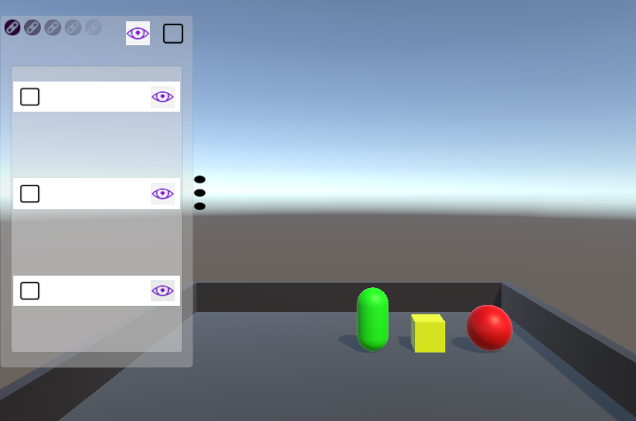
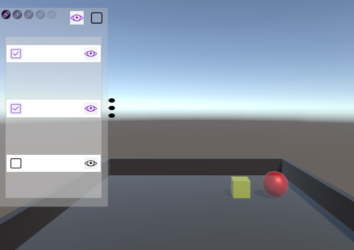
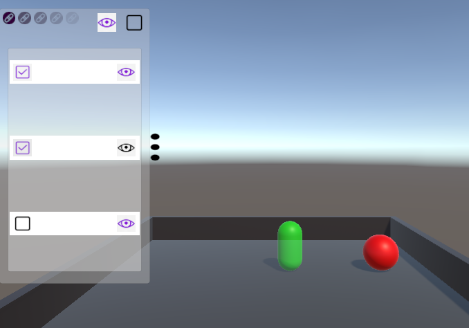
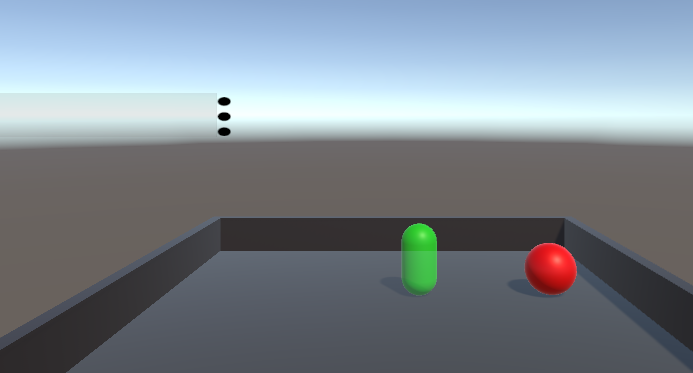

# Интерфейс

Здесь реализован интерфейс, через который можно управлять объектами на сцене, 
а именно скрывать и проявлять их, либо менять их прозрачность. Все объекты на сцене 
отображаются в списке на интерфейсе. У каждого такого объекта есть кнопка в виде глазика 
и кнопка в виде чекбокса. Нажимая на первую, можно скрыть или проявить объект на сцене, и, 
нажимая на вторую, можно сделать объект активным или неактивным.  
Всем активным объектам можно менять прозрачноть с помощью одной из 5 кнопок слева сверху на 
интерфейсе. Также, справа от этих кнопок есть кнопки глазика и чекбокса. Нажимая на них, 
все кнопки у элементов в списке интерфейса меняют своё состояние на противоположное.  
Также справа от интерфейса есть 3 точки, нажимая на которые можно скрыть или открыть интерфейс.

**Несколько картинок, показывающих работу программы:**
-

