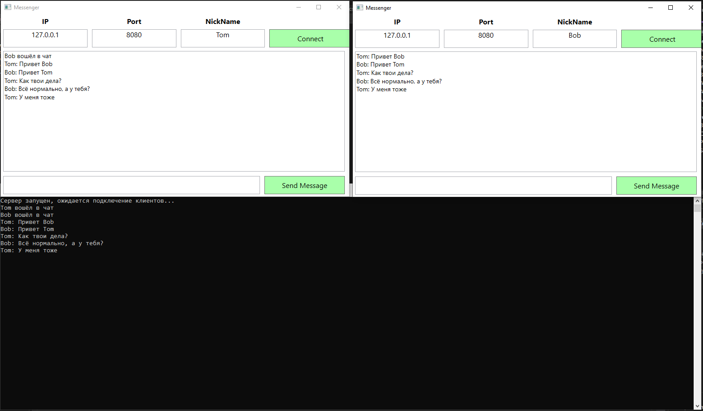

# Месенджер между 2 или более приложениями
**Связь между приложениями организована с помощью сокетов(TCP)**
-
Реализована возможность ввода/вывода сообщений. Клиент может посылать сообщения на сервер, 
который отправляет эти сообщения другим клиентам. Сообщение, полученное другими клиентами, 
выводится в окно сообщений.  

В проекте ServerClient находится вся логика для сервера и клиента. Реализован 
приём сервером подключающихся клиентов. Для сервера реализован приём сообщений от клиентов и 
их рассылка другим клиентам. А для клиента написана логика получения сообщений и их 
отправка серверу. Из этого проекта происходит запуск сервера в виде консольного приложения  

В проекте ClientWpf реализована визуальная часть программы, а именно сами клиенты. Здесь 
находится реализация создания клиентов и их подключения к серверу. Также именно здесь 
находятся методы для отправки и получения сообщений.  

**Последовательность запуска программы:**
-
1) Сначала __один раз__ запустите сервер, то есть проект ServerClient
2) Затем запустите минимум 2 экземпляра клиента, то есть проект ClientWpf
3) В каждом из клиентов нужно ввести имя в поле NickName и затем нажать кнопку Connect
4) Теперь можно отправлять сообщения между клиентами, вводя их в нижнее поле и 
нажимая кнопку Send. Все сообщения будут показываться в центральном окне

Пример работы приложения:  
