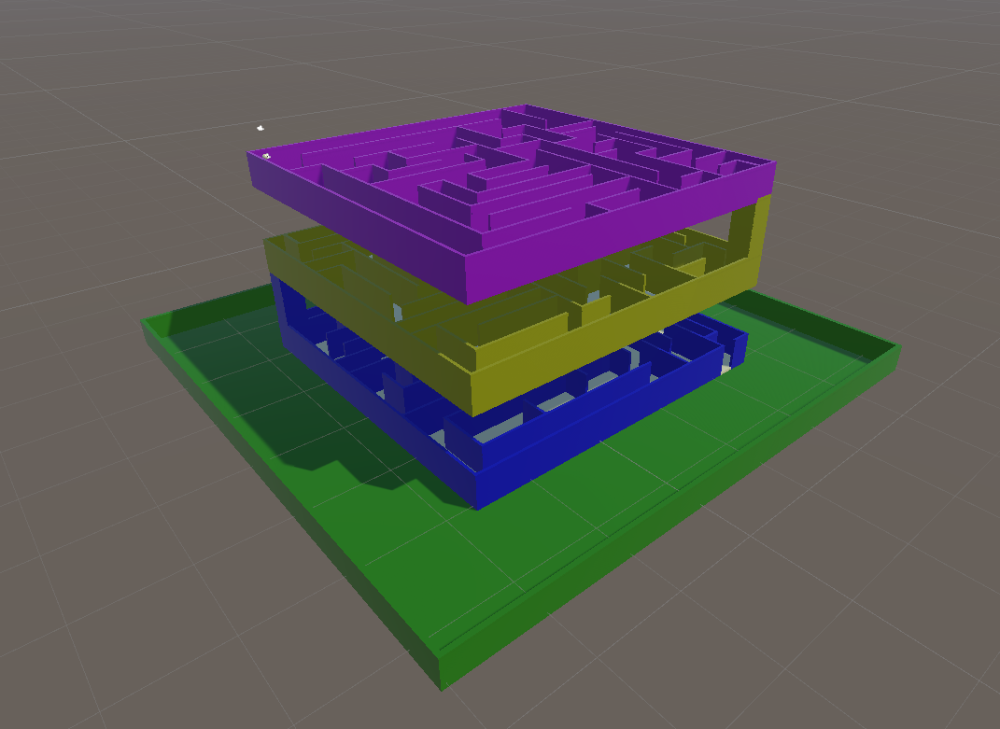
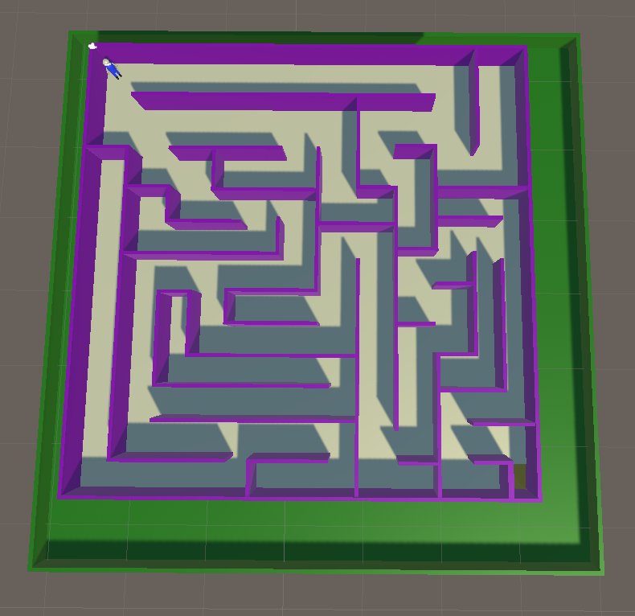
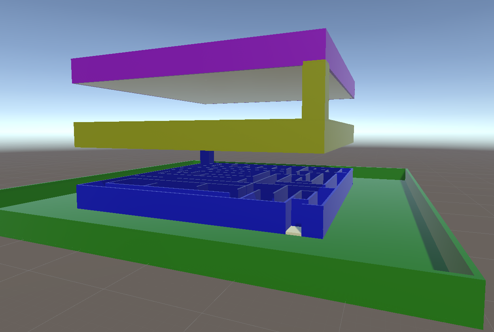
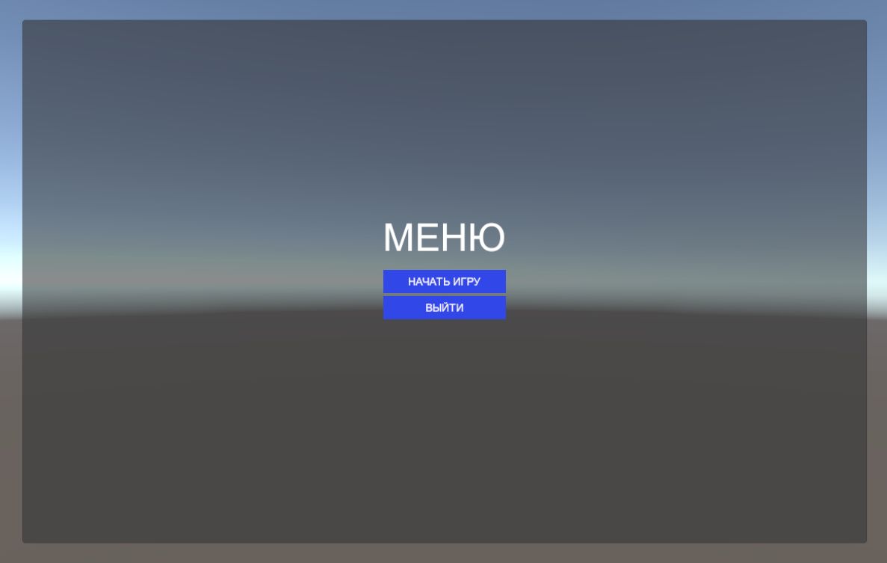
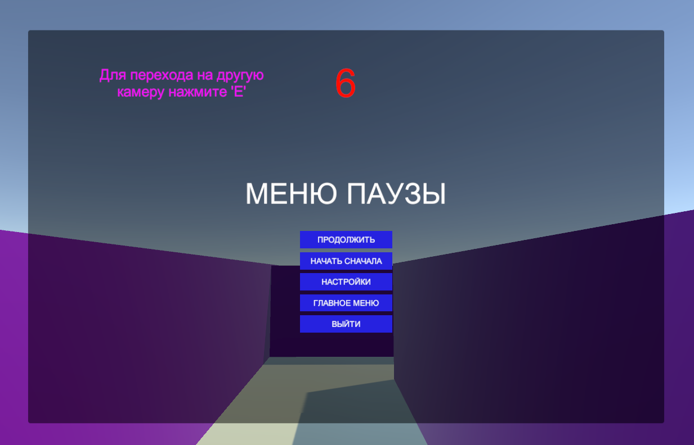
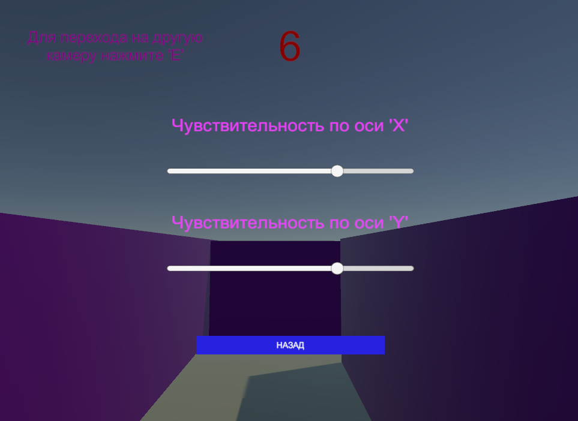
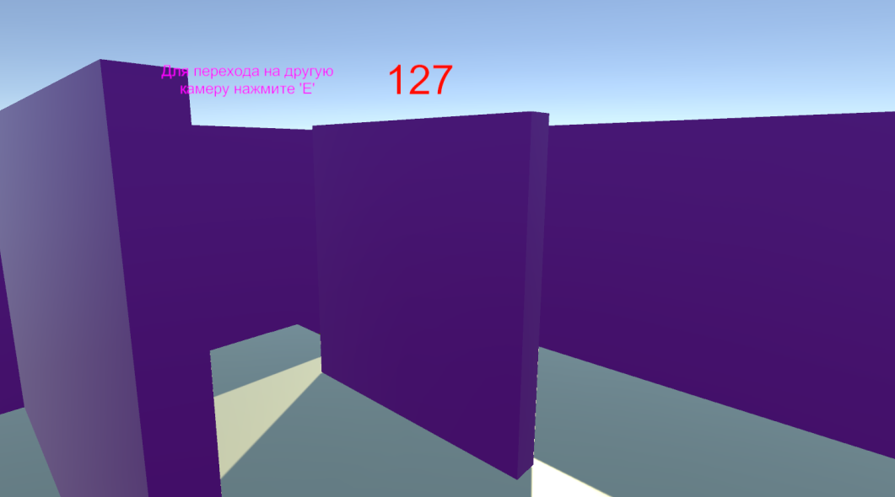
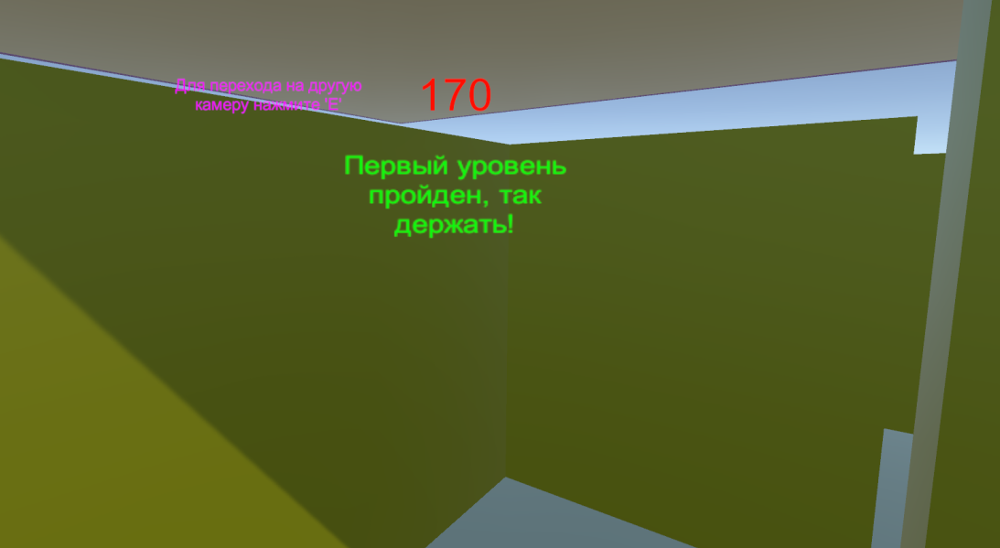
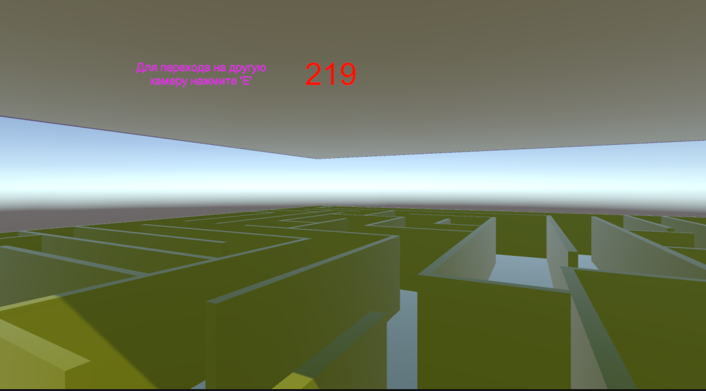
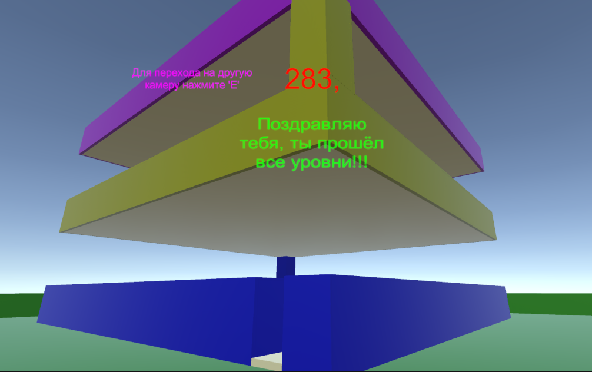

# ћини игра куб-лабиринт

3D игра куб-лабиринт реализована на игровом движке Unity.  
»грок может управл€ть персонажем в лабиринте и его цель выбратьс€ из этого лабиринта, 
состо€щего из 3 уровней, соединЄнных между собой спусками.
»грок начинает игру на самом верхнем уровне, с этого момента запускаетс€ таймер. 
“аймер остановитс€, когда игрок покинет лабиринт, то есть найдЄт выход с самого нижнего уровн€.  
Ќа верхнем и среднем уровне игроку нужно найти в лабиринте отверстие в полу. „ерез это отверстие 
игрок попадает на следующий уровень.  
Ќа нижнем уровне игроку просто нужно найти выход из лабиринта.  
¬ начале игры и при прохождении каждого уровн€, также как и при достижении финиша, игрок будет 
видеть текстовое сообщение о своЄм прогрессе в игре.

ѕри запуске игры игрока встречает начальное меню, где есть всего 2 кнопки: 'Ќачать игру' и '¬ыйти из игры'  
∆мЄм 'Ќачать игру' и с этого момента начинаетс€ отсчЄт времени и игрок может управл€ть персонажем. 

ћной было прин€то решение добавить дополнительную камеру, на которую можно переключитьс€, нажав 
на кнопку 'E'. Ѕез этой камеры действительно можно потер€тьс€ в лабиринте))

“акже при нажатии на 'esc' игрок попадает в игровое меню, где например можно начать игру сначала, 
выйти из неЄ или зайти в меню настроек, где € добавил единственную настройку чувствительности по 
оси 'X' и оси 'Y'.

**Ќесколько кадров игровой сцены:**
-
 
  

**Ќесколько кадров самого геймпле€:**
-

  

