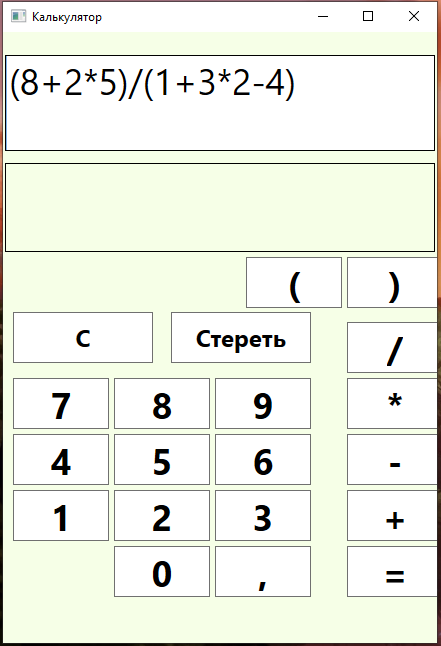
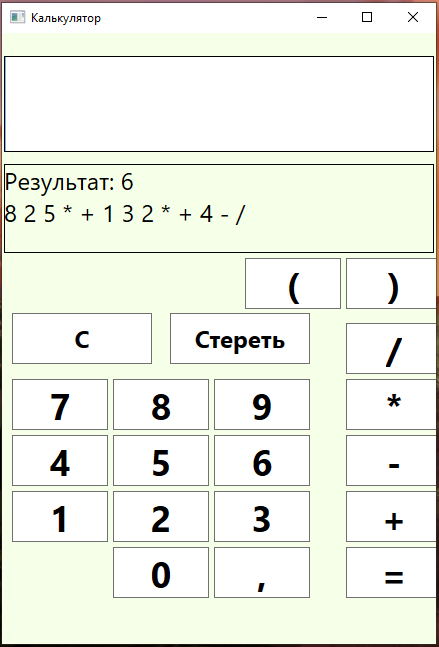

# Калькулятор

Реализован калькулятор, который на вход принимает арифмитическое выражение в инъекционной 
форме (2+4*3). На выходе калькулятор выводит результат арифметического выражения и его 
вид в формате обратной Польской записи (постфиксной записи).

Введённое пользователем арифметическое выражение сначала переводится в формат обратной 
Польской записи, так как такую запись проще обрабатывать, чтобы найти ответ, 
и затем из этой записи находится ответ в виде числа double

Калькулятор умеет работать с вещественными числами, он умеет выполнять такие математические 
операции как '/', '*', '-', '+'. Также умеет работать со скобками '(' и ')'.

В проекте CalculatorConsole находится консольный вариант приложения, но 
настоящая реализация находится в проекте CalculatorWPF, где 
калькулятор сделан с помощью WPF и пользователю доступны кнопки с числами и операциями

**Последовательность работы с программой:**
-
1) Запускаем проект CalculatorWPF и перед нами появляется сам калькулятор
2) Введите любое арифметическое выражение, используя кнопки на калькуляторе
3) Как будете готовы нажмите на кнопку '=' и тогда калькулятор покажет ответ, 
а также строкой ниже запись в формате обратной польской записи

Пример работы приложения:  
Здесь мы вводим арифметическое выражение

Здесь мы видим результат этого выражения, а также его запись в виде обратной Польской нотации

